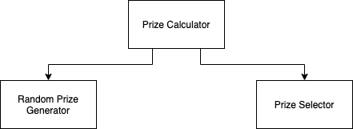

# Random Prize Calculator



Here are the three main components that you need to create:
1. Random Prize Generator - accepts a number and returns a list containing the prizes (with random values) in ascending order; count (or size of the list) of prizes is equal to the number provided
2. Prize Selector - accepts a list of prizes and returns a prize through a random function; see random function below.
3. Prize Calculator - accepts a number and returns a random prize; it will call the Random Prize Generator to generate list of prizes and the Prize Selector to select (randomly) a prize from the list.

## Random Function Steps
1. Generate a random value from 0.0 to 1.0 (e.g. 0.45000000)
2. Multiply the value in #1 to Pi (Math.PI)
3. Get the sine of the result of #2
4. Multiply the result of #3 to number of prizes provided
5. Round down the result of #4 using Math.ceil()
6. Convert the result of #5 into an Integer
7. Use the result in #6 to get the prize to return by Prize Selector

Here's a sample call to the random function
```java
Integer prizeIndex = getRandomIndex(prizes); // getRandomIndex is random function (or method)
Double selectedPrize = prizes.get(prizeIndex);
```

Here's a sample main class to run your program:
```java
public class PrizeCalculatorMain {

    public static void main(String[] args) {
        Integer numberOfPrizes = 5;

        PrizeCalculator prizeCalculator = new PrizeCalculator();
        Double prize = prizeCalculator.getRandomPrize(numberOfPrizes);

        System.out.println("Random Prize: " + prize);
    }

}
```

[Back to Home](README.md)
